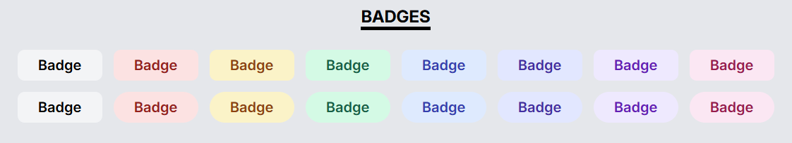
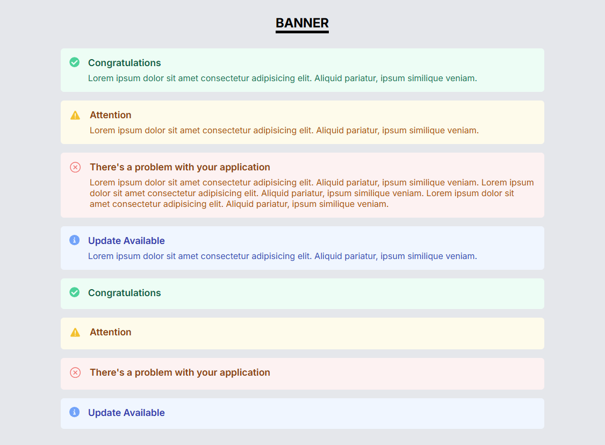
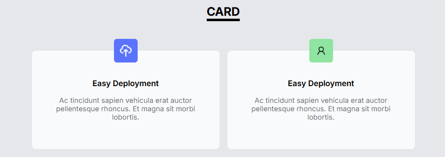
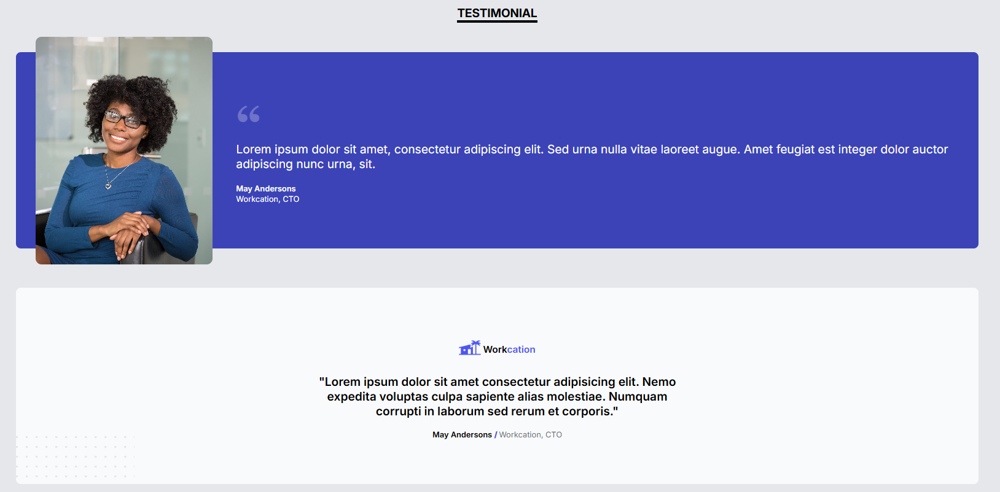
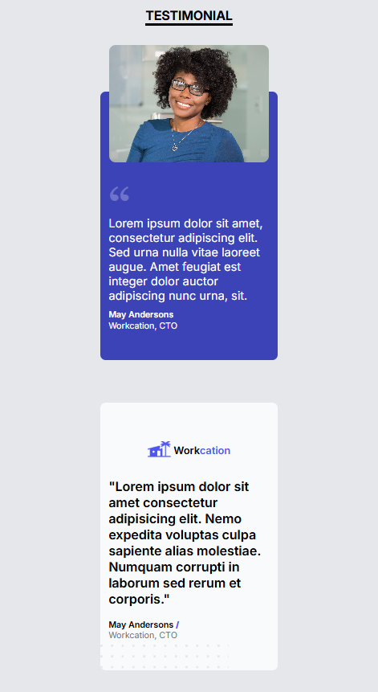
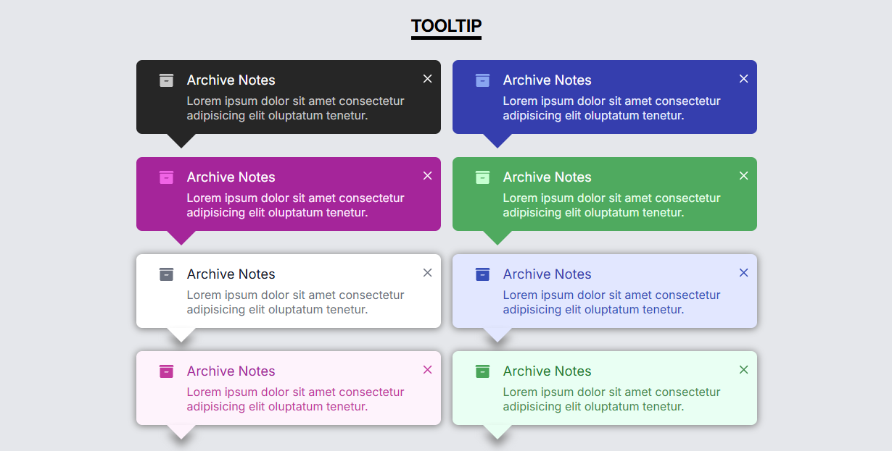
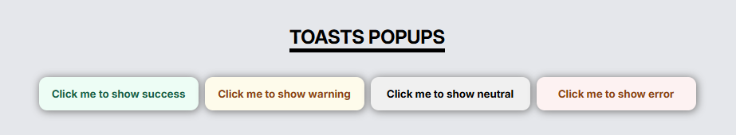
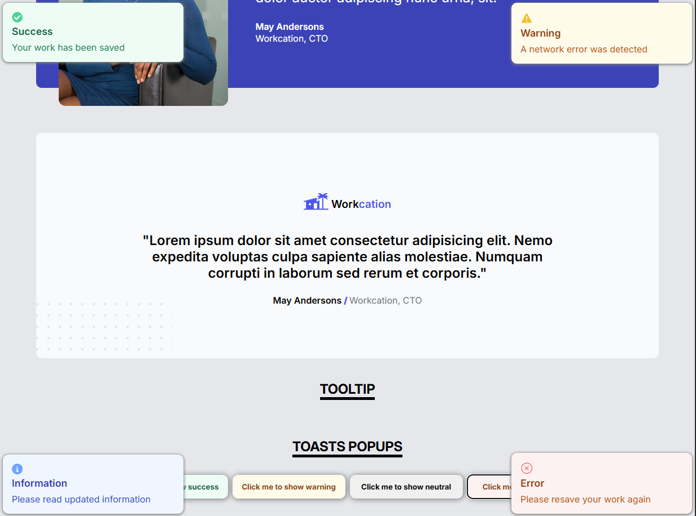

# React Components Library
A group of reusable and customizable group of React components, ranging from simple badges to interactive tooltips and popups.

## Get started
- Interact with the feature at: https://react-component-library-l671.onrender.com/

## Badges

<div align='center'>
    
</div>

```js
    //Example
    <Badge color='red'>Badge</Badge>
    <Badge variant='pill' color='red'>Badge</Badge>
```
* Accepted keyword and value
    1. `variant`: `'pill'` (if not specified, default to square appearance)
    2. `color`: `'red'`, `'yellow'`, `'green'`, `'blue'`, `'indigo'`, `'purple'`, `'pink'` (if not specified, default to gray appearance)

## Banner

<div align='center'>
    
</div>

```js
    //Example
    <Banner variant='success'>
        <Banner.Title>
            Congratulations
        </Banner.Title>
        <Banner.Text>
            Lorem ipsum dolor sit amet consectetur adipisicing elit.
            Aliquid pariatur, ipsum similique veniam.
        </Banner.Text>
    </Banner>
```
* Accepted keyword and value
    1. `variant`: `'success'`, `'warning'`, `'error'`, `'neutral'` (default to `'neutral'`)

## Card

<div align='center'>
    
</div>

```js
    //Example
    <Card img="/icon.png" backgroundColor='#3F75FE'>
        <Card.Title>
            Easy Deployment
        </Card.Title>
        <Card.Text>
            Ac tincidunt sapien vehicula erat
            auctor pellentesque rhoncus.
            Et magna sit morbi lobortis.
        </Card.Text>
    </Card>
```
* Accepted keyword and value
    1. `img`: image path to the icons
    2. `backgroundColor`: Color Code (can be in format other than in hex)

## Testimonial
<div align='center'>
    
    
</div>

```js
    //Example
    <Testimonial
        img="/pfp.jpg"
        name="May Andersons"
        role="Workcation, CTO"
    >
        Lorem ipsum dolor sit amet, consectetur adipiscing elit. Sed urna nulla vitae laoreet
        augue. Amet feugiat est integer dolor auctor adipiscing nunc urna, sit.
    </Testimonial>
```
* Accepted keyword and value
    1. `img`: image path to the profile pictures (If no img is not given, the second design without the profile picture will be displayed.)
    2. `name` & `role`: details of the person


## Tooltip
<div align='center'>
    
</div>

```js
    //Example
    <Tooltip variant='bold' color='blue'>
        <Tooltip.Title>
            Archive Notes
        </Tooltip.Title>
        <Tooltip.Text>
            Lorem ipsum dolor sit amet consectetur adipisicing elit oluptatum tenetur.
        </Tooltip.Text>
    </Tooltip>
```
* Accepted keyword and value
    1. `variant`: `'bold'`, `'light'`
    2. `color`: `'blue'`, `'pink'`, `'green'`

* Interactive features:
    - Can be closed by clicked on the 'X' button on top right.
    - The tooltip will fadeout slowly.


## Toasts
<div align='center'>
    
    
</div>

```js
    //Example
    <ToastBtn
        variant='success'
        bannerRole="toast"
        position="top-left"
        toastTitle="Success"
        toastText="Your work has been saved"
    >
        Click me to show success
    </ToastBtn>
```
* Accepted keyword and value
    1. `variant`: `'success'`, `'warning'`, `'error'`, `'neutral'` 
    2. `bannerRole`: `'toast'` (needed to change the behavior of banner to a toast)
    3. `position`: `top-left`, `top-right`, `bottom-left`, `bottom-right`
    4. `toastTitle` & `toastText`: String to be displayed in the toast

* Interactive features:
    - The toasts will disappear after 2s.


